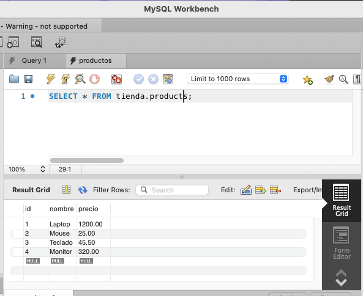
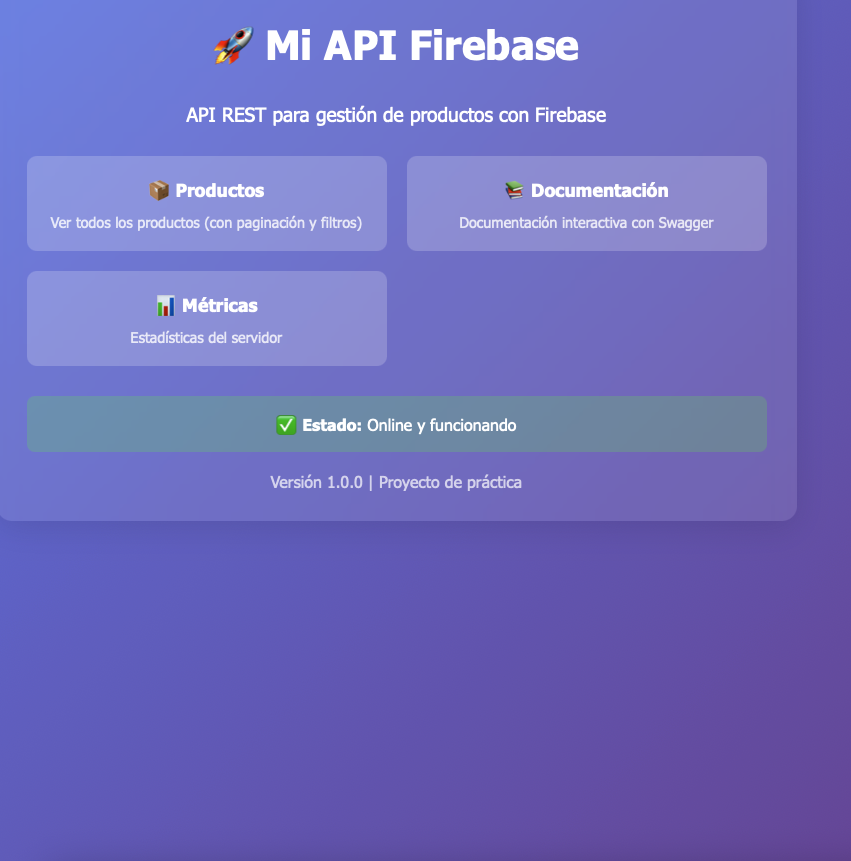
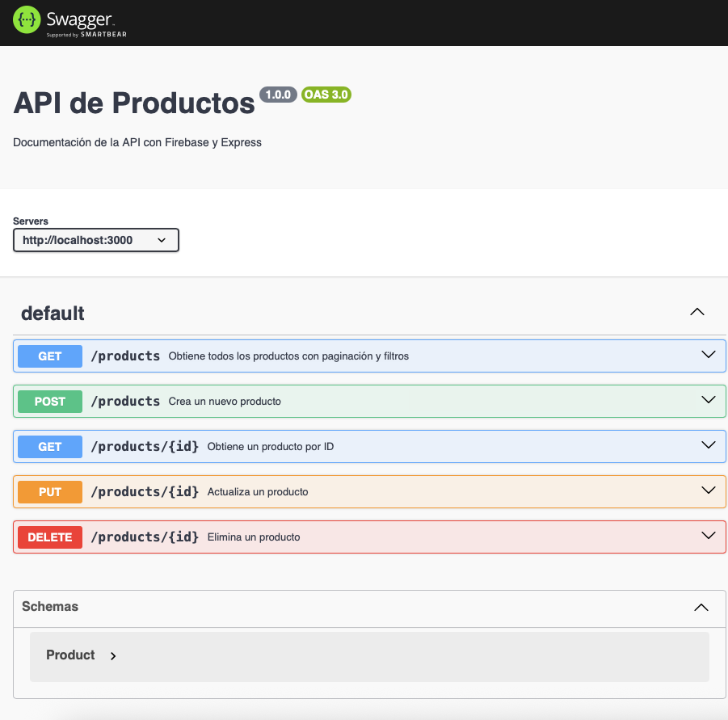
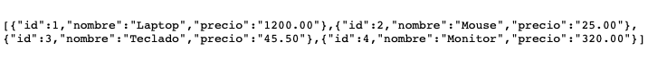

# API Portfolio

Este repositorio contiene una colección de APIs desarrolladas con buenas prácticas, incluyendo tests automatizados, documentación y ejemplos de uso.

## 🚀 Proyectos incluidos

### 📦 `mi-api` - API con MySQL

- **Base de datos**: MySQL
- **ORM**: mysql2
- **Funcionalidades**: CRUD completo de productos
- **Testing**: Jest + Supertest

### 🔥 `mi-api-firebase` - API con Firebase

- **Base de datos**: Firebase Firestore
- **Funcionalidades**: CRUD con paginación y filtros
- **Documentación**: Swagger UI integrado
- **Testing**: Jest + Supertest
- **Validación**: Joi para validación de datos

## Características

- **Desarrollo modular**: Cada API está organizada en carpetas independientes.
- **Tests automatizados**: Se incluyen pruebas unitarias y de integración.
- **Documentación**: Cada API cuenta con documentación detallada.
- **Ejemplos de uso**: Se proporcionan ejemplos para facilitar la integración.

## 🏗️ Estructura del proyecto

```
apis/
├── images/                  # Capturas de pantalla
│   ├── sql.png             # Base de datos MySQL
│   ├── api-firebase.png    # Interfaz API Firebase
│   ├── doc-swagger.png     # Documentación Swagger
│   └── products.png        # Endpoints de productos
├── mi-api/                 # API con MySQL
│   ├── src/
│   │   ├── config/         # Configuración DB
│   │   ├── controllers/    # Controladores
│   │   └── routes/         # Rutas
│   ├── package.json
│   └── README.md
└── mi-api-firebase/        # API con Firebase
    ├── config/             # Configuración Firebase
    ├── routes/             # Rutas
    ├── services/           # Lógica de negocio
    ├── test/               # Tests automatizados
    ├── swagger.js          # Configuración Swagger
    └── README.md
```

## Cómo ejecutar los tests

```bash
npm test
```

O según el gestor de paquetes y framework utilizado.

## Documentación

Cada API incluye un archivo `README.md` con:

- Descripción
- Instalación
- Uso
- Endpoints
- Ejemplos

## 📸 Capturas de pantalla

### API con MySQL (`mi-api`)



_Estructura y configuración de la base de datos MySQL_

### API con Firebase (`mi-api-firebase`)



_Interfaz principal de la API con Firebase_



_Documentación interactiva con Swagger UI_



_Endpoints para gestión de productos con paginación y filtros_

## Contribuir

1. Haz un fork del repositorio.
2. Crea una rama nueva.
3. Realiza tus cambios y añade tests.
4. Envía un pull request.

---

¡Explora las APIs y consulta la documentación específica en cada carpeta!
